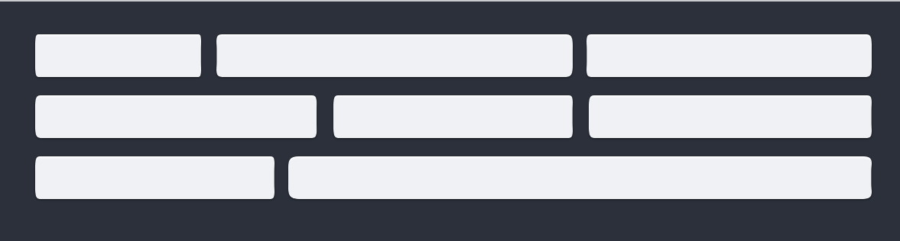

# redacted



Redacted is a minimalistic markdown editor and static site generation tool.

~~This content is then backed up to a cloud storage provider (AWS). The second piece is the actual static site generation build tool which takes the user entered content from storage and produces the static html and css files (images are hosted on cdn). These generated files can then easily be uploaded to a hosting platform of your choice (github pages, now, etc.).~~

## Get Started

```sh
yarn install
yarn run build
yarn run start
```

open your browser to `localhost:3000`

## TODO

- [X] Theming
- [X] Deployment hook 